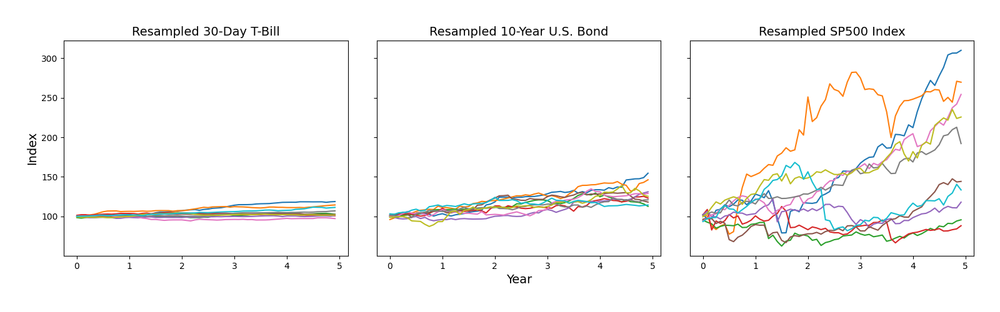
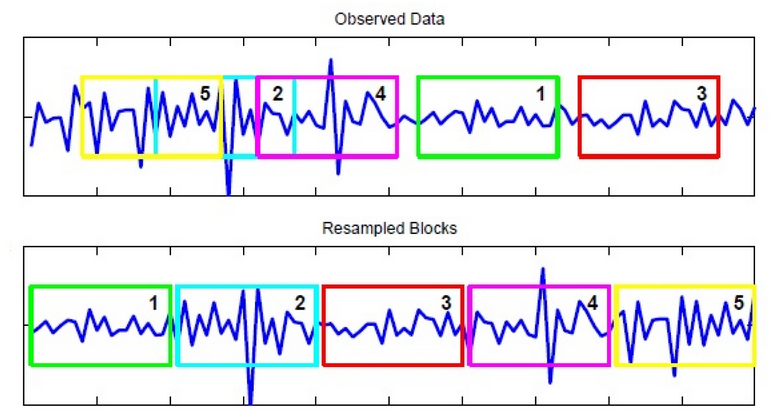

## Market Data Bootstrapper

A common problem in ML finance research is the availability of asset return data. The single realized historical path is insufficient for robust training of ML investment recommendation models. It is therefore necessary to generate additional time series data with similar statistical properties as real assets' return paths. One of the methods most widely accepted by finance practioners as the gold standard is stationary block bootstrap resampling (Patton et al., 2009) of historical return data. This repo implements the method in Python and Numpy (PyTorch version forthcoming). I developed this as part of a larger ML framework to create optimal portfolio management strategies, which uses this tool as one of its data sources for training and testing optimal investment strategies.

      
    <em > Example data generated by the bootstrapper tool.</em>

## How to use it

This code is designed to be easily incorporated into an existing ML pipeline by separating the dataset generation process into distinct steps: 1) Constructing a dictionary with all  metadata that specifies how the data is to be generated, such as what asset basket is to be simulated; 2) Processing the raw historical market data in preparation for the bootstrap; and 3) Performing the actual bootstrap resampling algorithm. The code includes functionality to bootstrap data from any user-provided historical data set and specify the source date range, expected sample block size, etc. Any length of market simulation with any frequency can be generated, subject to the availability of source data. The example data provided is monthly data for standard stock indices and bonds, as well as "market factors," starting from 1927 until 2022. 

The file `bootstrap_demo.py` demonstrates how to generate any number of market path simulations for an example asset basket of a SP500 stock index, a 10-Year U.S. Treasury Note bond, and a 30-Day U.S. Treasury bill (cash equivalent) for 5 years on monthly frequency. The generated data is then plotted for visual comparison. 

## Motivation and method summary

Financial time series data are believed to have serial dependency, and to not be i.i.d. Bootstrapping individual returns breaks this dependency. Sampling blocks of data thus has the desirable trait of preserving of the serial dependency between data. 

      
    <em > Diagram credit to
<a href="https://journals.plos.org/plosone/article?id=10.1371/journal.pone.0131111">El Anbari, Abeer, and Ptitsyn (2015)</a>
</em>

The diagram above illustrates the concept of the resampling algorithm. The blocksize follows a shifted geometric distribution with a given expected block size. If a chosen block exceeds the range of the historical data, the beginning of the range is sampled instead. 

